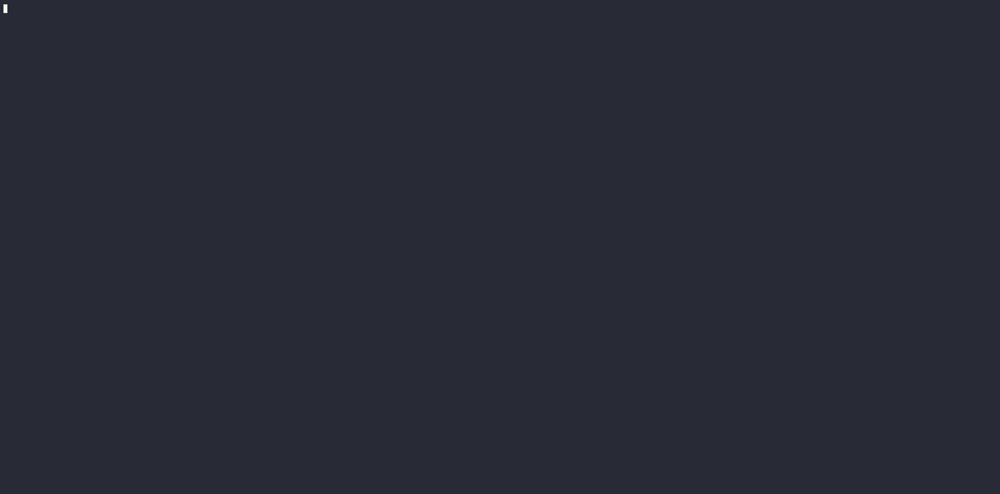

# cobra-ui 

The cobra-ui package empowers developers to craft immersive and interactive user interfaces seamlessly into their CLI applications (cobra-ui is a cross platform UI that can be integrated easily with Cobra CLIs [Cobra](https://github.com/spf13/cobra) or other CLI tools )

## Features

- **File Input with Pagination**: Facilitate the selection of files from a directory with built-in pagination support (10 files/page). Users can navigate through large sets of files seamlessly.

- **Error Handling**: Handle errors gracefully during user interactions. When a handler encounters an error, it returns an error object containing relevant information about the error. The UI displays the error message to the user and prompts the question again.
  
- **Single-Choice Questions**: Allow users to select one option from a list of choices.
  
- **Text Input Questions**: Prompt users to enter text-based inputs.
  
- **Password Input Questions**: Securely collect password inputs from users, hiding the entered characters for privacy.
  
- **Dynamic Pagination**: Automatically paginate choices for single-choice questions with more than 10 options, ensuring a smooth user experience without overwhelming them with too many choices at once.
  
- Each question can have separately its own string cursor and color (the default cursor if not specified is ->)


      
## **FilePath Example**


```
package main

import (
	"fmt"

	"github.com/fatih/color"
	cobra_ui "github.com/sabouaram/cobra-ui"
)

func main() {
	var selectedFile string
	ui := cobra_ui.New()
	ui.SetQuestions([]cobra_ui.Question{
		{
			Text:     "Select a file:",
			Color:    color.FgCyan,
			FilePath: true,
			Handler: func(filePath string) error {
				selectedFile = filePath
				return nil
			},
		},
	})
	ui.RunInteractiveUI()
	fmt.Printf("Selected file full path: %s\n", selectedFile)
}

```


**Choices Question  Example**


```
package main

import (
	"fmt"

	"github.com/fatih/color"
	cobra_ui "github.com/sabouaram/cobra-ui"
)

func main() {
	var choice string
	ui := cobra_ui.New()
	ui.SetQuestions([]cobra_ui.Question{
		{
			CursorStr: "==>",
			Color:     color.FgCyan,
			Text:      "What is your preferred programming language?",
			Options:   []string{"Go", "Python", "JavaScript", "Java"},
			Handler: func(input string) error {
				choice = input
				return nil
			},
		},
	})
	ui.RunInteractiveUI()
	fmt.Printf("Selected choice: %s\n", choice)
}


```


**Text Input Example**


```

package main

import (
	"errors"
	"fmt"
	"strconv"

	cobra_ui "github.com/sabouaram/cobra-ui"
)

func main() {

	var (
		age int
		err error
	)

	tui := cobra_ui.New()
	tui.SetQuestions([]cobra_ui.Question{
		{
			Text: "Enter your age: ",
			Handler: func(input string) error {
				age, err = strconv.Atoi(input)
				if err != nil {
					return errors.New("age must be an integer - retry")
				}
				return nil
			},
		},
	})
	tui.RunInteractiveUI()
	fmt.Printf("Your entered age is %d \n", age)
}


```




**Password Input Example**

```
package main

import (
	"fmt"

	cobra_ui "github.com/sabouaram/cobra-ui"
)

func main() {

	var (
		passwordEntered bool
		pwd             string
	)

	ui := cobra_ui.New()
	ui.SetQuestions([]cobra_ui.Question{
		{
			Text:         "Enter your password: ",
			PasswordType: true,
			Handler: func(password string) error {
				passwordEntered = true
				pwd = password
				return nil
			},
		},
	})
	ui.RunInteractiveUI()
	if passwordEntered {
		fmt.Printf("Password entered => %s\n", pwd)
	}

}

```


**UI with Cobra Example**


```
package main

import (
	"fmt"
	cobra_ui "github.com/sabouaram/cobra-ui"
	"github.com/spf13/cobra"
)

var choice string
var rootCmd = &cobra.Command{
	Use:   "myapp",
	Short: "A sample cobra cli app",
	Run: func(cmd *cobra.Command, args []string) {
		fmt.Println("Welcome to my cobra cli app!")
		fmt.Println("Thank you for choosing ", choice)
	},
}

func main() {

	ui := cobra_ui.New()
	ui.SetQuestions([]cobra_ui.Question{
		{
			Text:    "What is your preferred programming language?",
			Options: []string{"Go", "Python", "JavaScript"},
			Handler: func(input string) error {
				choice = input
				return nil
			},
		},
	})

	ui.SetCobra(rootCmd)
	ui.BeforeRun()

	if err := rootCmd.Execute(); err != nil {
		fmt.Println(err)
	}
}

```
